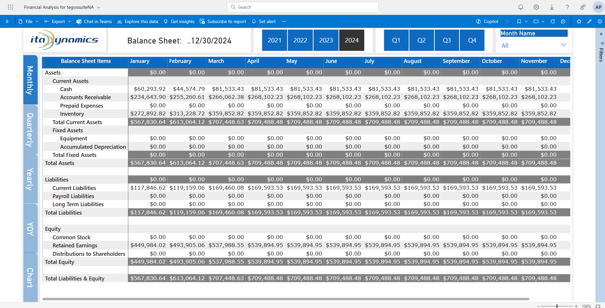

# Balance Sheet

- To access the balance sheet, click the "Balance Sheet" button located on either the left or middle section of the navigation pane.
- At the top, you can select different years or months to view the financial data for that period. By default, current year is selected.
- Balance Sheet have standard order of Assets, Liabilities and Equity.
- Each category is clearly labeled, and the rows and columns are organized to make it easy to follow the financial trends over time. Just select the desired time frame using the filters, and the report will display the relevant financial data.
- We offer multiple viewing levels tailored to your needs—Monthly, Quarterly, Yearly, Year-over-Year comparisons, and more insightful charts.
- Click on ITA Dynamics Logo anytime to go back to navigation page.

