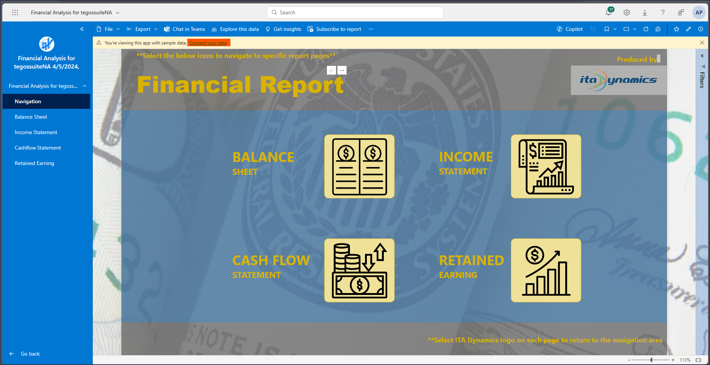
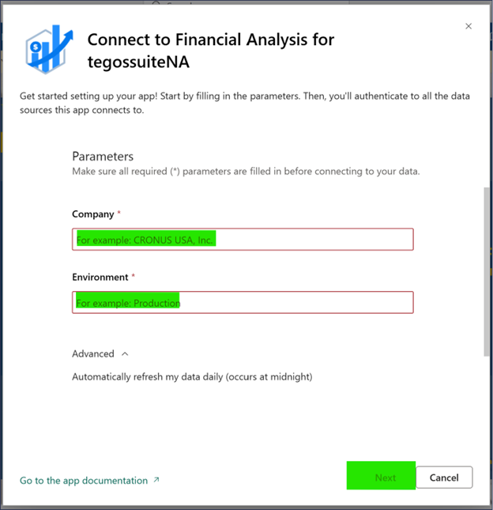
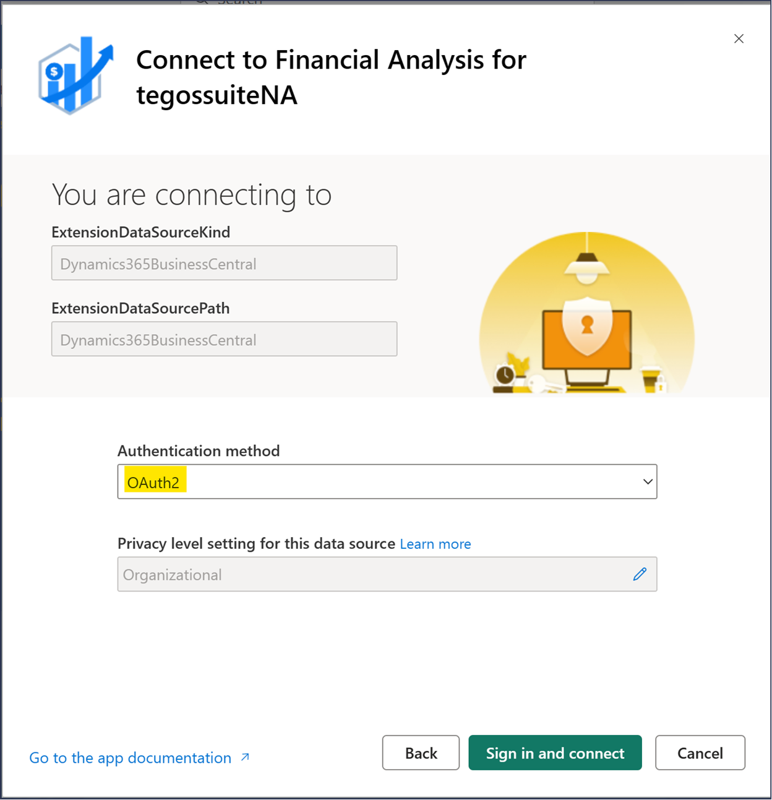
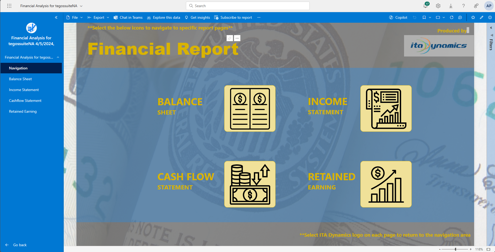

# Connect your Data:
1.	Upon opening the app, you'll find a collection of reports and visuals. Currently, these are generated using sample data. To explore your own data, click on the "Connect Your Data" link.

2. A popup window will appear, in this window enter Company Name in Company parameter box and enter Environment Name in Environment parameter box. Then click on the Next button at the bottom of the page. [^1] 

3. An authentication window will appear, allowing only OAuth2 as the authentication method. Click the "Sign in and connect" button located at the bottom of the page. 

4. Sign in window will appear, use your credentials and login. 

5.	The report will undergo a refresh, and the warning window will disappear. At this point, your report is seamlessly connected to your environment's data. 

---

[^1]: Company Name and Environment Name can be found at the top of the business central page.