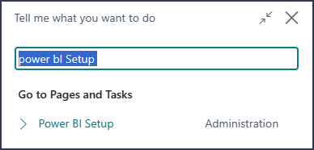
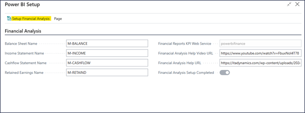
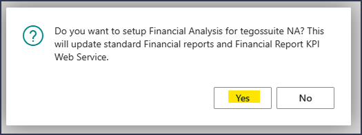
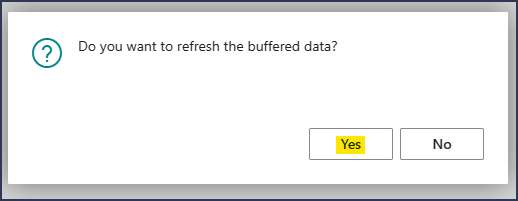

# tegossuite - NA for PowerBI Extension Setup
Using this page, we will establish the essential data and API required for all the PowerBI reports. If the necessary data is already present before running the setup process it will seamlessly bypass that step. To start the setup process, follow the instruction below:

1. Access the Power BI Setup Page. You can reach this page by searching for 'PowerBI setup' in the Tell Me box and selecting the relevant option. \
 
2. Within the Financial Analysis tab, you'll find the standard financial reports generated during the extension setup, along with the Financial Reports KPI Web Service name. It's crucial to verify that these are indeed the standard financial reports. 
3. Next, locate and click the 'Setup Financial Analysis' button positioned at the top of the Power BI Setup page. This action will trigger an update for the standard financial reports mentioned earlier, along with the Financial Report KPI Web Service. Upon clicking, a confirmation popup will appear; simply click 'Yes' to proceed with the setup. 
4. Once the setup process is successfully completed, a prompt will appear asking for confirmation to refresh buffered data. Click 'Yes' to proceed. This step ensures that the data in the Financial Report KPI Web Service is updated. 
5. The refresh process will be completed in a few seconds. Once done, close the setup page to finalize the configuration.
