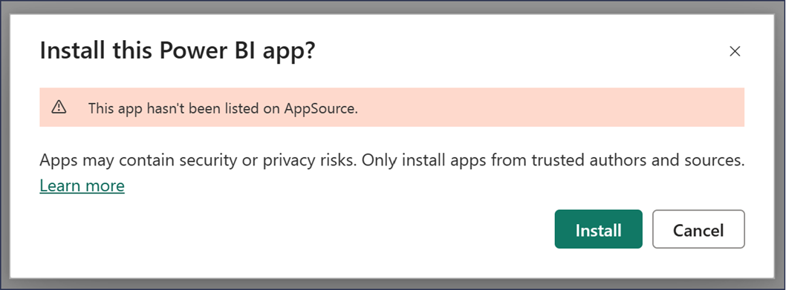
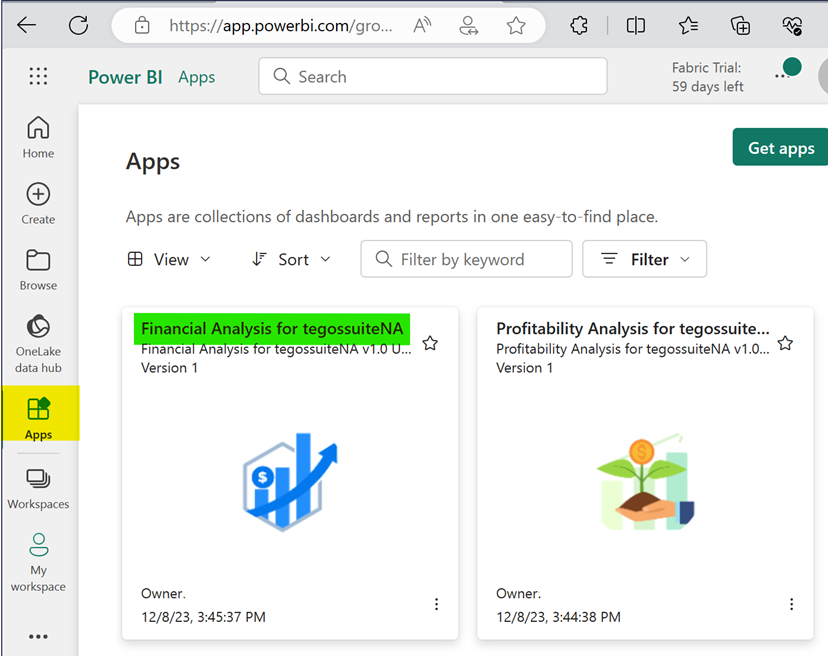

# How to install PowerBI report - Financial Analysis for tegossuiteNA?
After completing these setups on Business Central we need to install “Financial Analysis for tegossuiteNA” PowerBI app.

1. Navigate to the Power BI service:
   - Go to [https://app.powerbi.com/](https://app.powerbi.com/){:target="_blank"} and sign in with your Power BI account.

2. To install "Financial Analysis for tegossuiteNA" through the provided link, simply click on the link below:
   [Direct Link to install Financial Analysis for tegossuiteNA](https://app.powerbi.com/Redirect?action=InstallApp&appId=36556df9-6bb8-4282-9fbf-bef7312b8c3d&packageKey=570e3741-3c2b-467a-aba0-ea31a806b9d0LjMY9P9W8fs8lfsf-5f1IhppVIG-Oi5TBaiOhIt1pgo&ownerId=1b1f7cb3-698a-4f96-a24f-f56ca891c201&buildVersion=3)

3. A popup window will prompt app installation confirmation. Click on “Install” button. The app will be added to your Power BI account. 

4. **Access the app:** Go to "Apps" in the navigation pane and click on the installed app to launch it.
