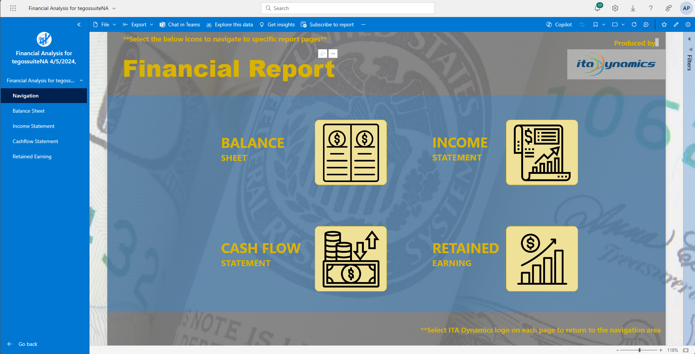

# Navigate Financial Analysis for tegossuiteNA?

Upon opening the report, it defaults to the navigation page. The left pane displays a list of available reports, providing easy navigation to different report pages. On the navigation page's middle section, you'll find icons and names of the reports. Clicking any icon seamlessly directs you to a specific report. The ITA Dynamics logo at the top right serves as a shortcut; clicking it takes you to the ITA Dynamics help page.[^1]

### 1. Balance Sheet
### 2. Income Statement
### 3. Cashflow Statement
### 4. Retained Earning

---
[^1]: The ITA Dynamics logo positioned at the top right corner serves as a direct link to ITA Dynamics comprehensive help page, designed specifically for navigating through all related PowerBI Reports.
