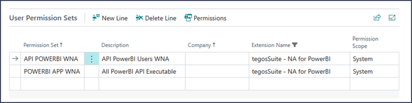

# License Requirement:
To access and use the PowerBI reports, users require specific licenses on both the Power BI and Business Central sides:
- **Business Central:** \
  <u>Business Central Essential or Premium license:</u> These licenses grant access to the Business Central data and features required for Power BI integration.
- **Power BI:**\
  <u>Power BI Pro:</u> This is the minimum license required to access and interact with shared Power BI apps.
  <u>Power BI Free:</u> Users with free Power BI Free licenses can view published reports but cannot interact with them or modify the content.

