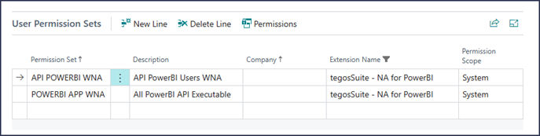

# User Permissions Required:
To access the underlying data of Business Central through the API or the PowerBI report user should have following permission set (at minimum) assigned to them.
1. **API PowerBI WNA**
2. **PowerBI APP WNA**

Assign these permissions through the Business Central user management interface.

